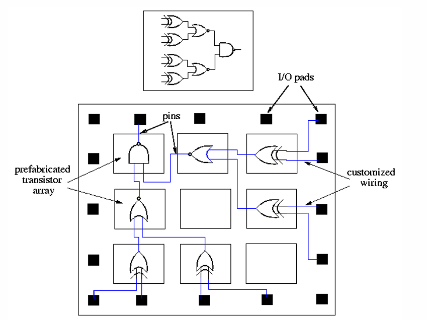
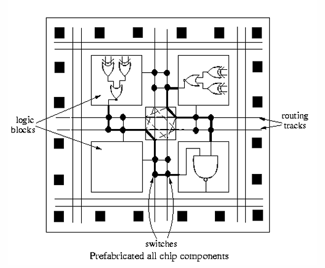
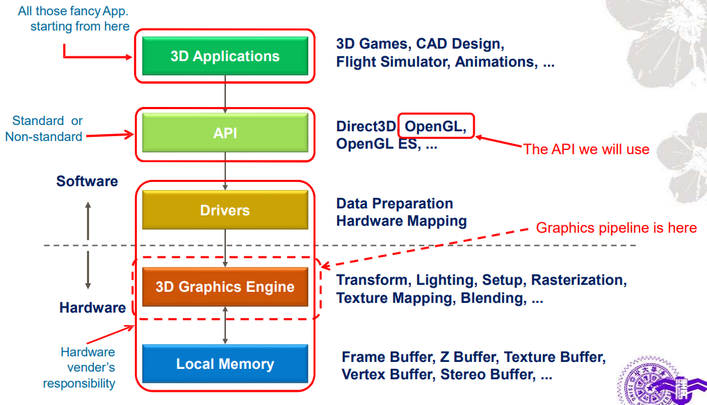

> 參考 清華大學 李潤容老師 計算機圖學講義

# Introduction to Computer Graphics

## What is Computer Graphics
|Input|Output|Category|
|:-:|:-:|:-:|
|Image|Image|Image Processing|
|Description Images|Description|Computer Vision/ Pattern Recognition|
|Description|Image|Computer Graphics|

### Image Processing
- Performing various types of operations on an input image, and output an image with some useful information
- Ex: Edge Detection, Image Compression

### Computer Vision / Pattern Recognition
- Computer Vision
  - Building a artificial system that obtain information from images
- Pattern Recognition
  - Classify data based on either prior knowledge or on statistical information extracted from the patterns
- Ex: Object Detection, Tracking, Classification, Recognition

### Computer Graphics
- Concern the pictorial synthesis of real or imaginary objects from their computer-based models
- 2D graphics
  - Ex: Texts, 2D lines/ polygons/ images...
- 3D graphics
  - Project the objects onto 2D projection plane and render
- Types
  - Passive Stereo
    - The 3D effect is achieved by presenting slightly different images to each eye using techniques such as polarization or color filtering.
    - Ex:Anaglyphic 3D glasses (紅藍 3D 眼鏡)、Polarization 3D glasses (偏光 3D 眼鏡) 
  - Active Stereo
    - Involve synchronizing shutter glasses or alternate-frame sequencing with the display to present different images to each eye at high speed.
    - Ex: Shutter Glasses、VR display
  
# Graphics Hardware System

## GPU 
- Graphics Processing Unit
- Very high complexity with massively parallelism

## Frame Buffer
- Memory location for storing display data during processing
  - Front buffer (Current display buffer)
  - Back buffer (Nexy display buffer)

### Screen/ Display Refresh
- Retrieve **front buffer** pixels for displaying pixel colors on screen
- Constant refresh rate
- Scan-line based display
  - 從左上往右，一行一行往下顯示

### Single Buffering
- Display after rendering complete
  - cannot render during display
- Rendering during displaying
  - Display incomplete result
  - 畫面可能會有黑黑的
- Not synchronzied with display refresh
  - ??

### Double Buffering
- A techinique to prevent from displaying incomplete frame
  

### Full Screen Display
- Uses Double Buffering or Triple Buffering
- Flip display by changing **display base address** to corresponding buffer

### Window Mode Display
- Uses Double Buffering or Triple Buffering
- Flip display by using 2D bitblt to move **back buffer** frame on to **front buffer** display

# 3D Graphics Pipeline
- Almost everything you see on the display is processed by the graphics pipeline
- It is realized by graphics hardware (GPU) or by software (CPU)

## Graphics Rendering Process

## OpenGL
OpenGL defines the function specification of each API and leaves the implementation to the vendors themselves
- OpenGL 只有定 SPEC，具體怎麼做留給硬體廠商
- 每個硬體可能執行運算的方式不太一樣，像是做加法時，可能精度不一樣
