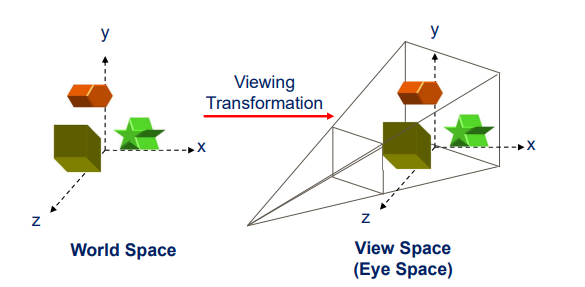

> 參考 清華大學 李潤容老師 計算機圖學講義

# Introduction to Computer Graphics

## What is Computer Graphics
|       Input        |   Output    |               Category               |
| :----------------: | :---------: | :----------------------------------: |
|       Image        |    Image    |           Image Processing           |
| Description Images | Description | Computer Vision/ Pattern Recognition |
|    Description     |    Image    |          Computer Graphics           |

### Image Processing
- Performing various types of operations on an input image, and output an image with some useful information
- Ex: Edge Detection, Image Compression

### Computer Vision / Pattern Recognition
- Computer Vision
  - Building a artificial system that obtain information from images
- Pattern Recognition
  - Classify data based on either prior knowledge or on statistical information extracted from the patterns
- Ex: Object Detection, Tracking, Classification, Recognition

### Computer Graphics
- Concern the pictorial synthesis of real or imaginary objects from their computer-based models
- 2D graphics
  - Ex: Texts, 2D lines/ polygons/ images...
- 3D graphics
  - Project the objects onto 2D projection plane and render
- Types
  - Passive Stereo
    - The 3D effect is achieved by presenting slightly different images to each eye using techniques such as polarization or color filtering.
    - Ex:Anaglyphic 3D glasses (紅藍 3D 眼鏡)、Polarization 3D glasses (偏光 3D 眼鏡) 
  - Active Stereo
    - Involve synchronizing shutter glasses or alternate-frame sequencing with the display to present different images to each eye at high speed.
    - Ex: Shutter Glasses、VR display
  
# Graphics Hardware System

## GPU 
- Graphics Processing Unit
- Very high complexity with massively parallelism

## Frame Buffer
- Memory location for storing display data during processing
  - Front buffer (Current display buffer)
  - Back buffer (Nexy display buffer)

### Screen/ Display Refresh
- Retrieve **front buffer** pixels for displaying pixel colors on screen
- Constant refresh rate
- Scan-line based display
  - 從左上往右，一行一行往下顯示

### Single Buffering
- Display after rendering complete
  - cannot render during display
- Rendering during displaying
  - Display incomplete result
  - 畫面可能會有黑黑的
- Not synchronzied with display refresh
  - ??

### Double Buffering
- A techinique to prevent from displaying incomplete frame
  

### Full Screen Display
- Uses Double Buffering or Triple Buffering
- Flip display by changing **display base address** to corresponding buffer

### Window Mode Display
- Uses Double Buffering or Triple Buffering
- Flip display by using 2D bitblt to move **back buffer** frame on to **front buffer** display

# 3D Graphics Pipeline
- Almost everything you see on the display is processed by the graphics pipeline
  - Windows UI、Video Games 等
  - 不過像播影片就不算，它是直接寫到 frame buffer，沒有經過 graphics pipeline
- It is realized by graphics hardware (GPU) or by software (CPU)
  - 用 hardware 可以比較快，但如果沒有 GPU 加速，用 software (CPU) 也可以算
  
## Graphics Rendering Process

### 3D Graphics Engine
- 屬於硬體，Graphics pipeline 就在這邊
  
### Driver
- 不是所有的硬體可以解決所有問題，有些事情你會以為硬體幫你做，其實是 Driver 在做。有時候有 Bug，它會幫你用 Driver (software) 的方式繞過去，看起來是硬體修復了
- 做 Hardware 的人通常也負責做 Driver，雖然它算是軟體

## Inside a 3D Graphics Pipeline
### Fixed Function Pipeline
每個 Stage 功能都是寫死的，像是 Transform and Lighting，所以效果都看起來差不多，現在很少用

### Programmable Pipeline
把 Fixed Function Pipeline 其中某幾個功能包裝成 Shader，讓 programmer 可以自己改，像是多了 Vertex Shader 來取代原本的 Transform and Lighting

#### Modeling

#### Transform
放大、縮小、平移、旋轉
1. Geometrical Transformation (Model Transformation)
- From **Object Space** to **World Space**
  - 每個物體有自己的座標系

2. Viewing Transformation
- From **World Space** to **View Space**

3. Projection Transformation
- From **View Space** to **Screen Space**

#### Lighting
Simulate the Effect of Light-Object Interaction
- 簡化成 Ambient(環境光) + Diffuse(漫反射光) + Specular Reflection(鏡面光)
  

- [光照基础 - LearnOpenGL-CN](https://learnopengl-cn.readthedocs.io/zh/latest/02%20Lighting/02%20Basic%20Lighting/)

#### Triangle Setup
對於一個三角形，算出每邊的斜率，三個頂點的座標不一定是整數，但是畫的點座標必須是整數，所以要得到三角形內部的所有整數座標

#### Rasterization
- 根據頂點的顏色，用內插法算出三角形內部的顏色
  

- Line Rasterization
  

#### Hidden Surface Removal
移除被擋住、看不到的地方

#### Texture Mapping

#### Rendering
##### Color Composition
Render with lighting and texturing

##### Blending
Translucent Effect

物體透明度和桌子透明度都變 50%，然後混合

#### Advanced Features
##### Shadow
- Hard Shadow
- Soft Shadow

##### Anti-Aliasing
Smooth out the Jaggy Edges

##### Shader

###### Vertex Shader
- Process vertices
  - Transformation
  - Lighting 
  - Displacement
- Operate on a single input vertex and produce a single output vertex

###### Tessellation/Geometry Shader
- 近的時候可以切成很多小三角形，遠的時候切比較大
- Process priitives
  - Point sprite tessellation
  - Wide line tessellation
  - Shadow volume generation
  - Surface subdivision
- Inputs one primitive and outputs can be more than one primitives

###### Pixel Shader
- Process pixels
  - Texture mapping
  - Color combine
  - Per-pixel lighting
  - ...
- Inputs one pixel and outputs one pixel at same position, or no pixel at all

# Introduction to OpenGL
## What is OpenGL
- Open Graphics Library (OpenGL) is an open standard for **cross-language**, **cross-platform** API specification
- OpenGL is a set of **APIs** used to write 2D/3D graphics applications
- OpenGL defines the function specification of each API and leaves the implementation to the vendors themselves
  - OpenGL 只有定 SPEC，具體怎麼做留給硬體廠商
  - 每個硬體可能執行運算的方式不太一樣，像是做加法時，可能精度不一樣

## Other Graphics APIs
- Direct3D
  - **Proprietary** Microsoft Windows 3D graphics API
- Vulkan
- OpenGL ES 
  - OpenGL for Emnedded Systems
- Web-based OpenGL
- Metal
- Mantle

## OpenGL vs. Direct3D

## OpenGL Extension
硬體廠商可以寫自己的 OpenGL Extension，像是 AMD、NVDIA...
- Advantages
  - Develop new functionality before new API spec is released
  - Hardware vendors can expose their new hardware features via extension first
  - Extension becomes core function (or extension) after being approved by ARB(Architecture Review Board)
- Disadvantages
  - It is vendor specific before approved by ARB
  - Compatibility
- GLEW/GLAD can help in querying and loading OpenGL extensions

## Why OpenGL
- Cross-platform
  - Windows Mac OSX, Linux
- Better backward compatibility
  - 舊的 OpenGL code 通常還是可以跑
- Run on various hardware platforms
  - OpenGL, OpenGL ES, WebGL

## Convention of an OpenGL API

### Data Types
C++ data types 和 OpenGL data types 大部分一樣，但還是有些許不同

## OpenGL Pipeline

[Image synthesis and OpenGL: graphics pipeline](http://romain.vergne.free.fr/teaching/IS/SI03-pipeline.html)

- 紅色代表 programmable，虛線代表可以不需要，但還是建議要寫 fragment shader 比較好

## OpenGL Shading Language
- High-Level shading language based on C programming language
- DirectX + HLSL vs. OpenGL + GLSL
- Hardware vendors will provide shader compiler to optimize the shader codes for deriving best performance running on their hardware architecture

## OpenGL 工具

### OpenGL Context/Window Creation
- **context** stores all the states associated with the instance of OpenGL rendering
- **window** is the window where your rendering result displayed
- **event handlings** process different kinds of input such as keyboard and mouse

A cross-platform toolkit for writing OpenGL programs
- Support application frameworks to control the platform’s **window system** and **event handling**

##### GLUT
- Pretty old and no longer maintained

#### Freeglut
- An alternative to GLUT
- https://freeglut.sourceforge.net/
  
##### GLFW
- https://www.glfw.org/

### OpenGL Loading Libraries
OpenGL loader checks the graphics driver for which OpenGL version profile is supported and gets all the function pointers as well as the supported extensions

##### GLEW
The OpenGL Extension Wrangler Library
- A cross-platform open-source C/C++ extension loading library
- Provides efficient run-time mechanisms for determining which OpenGL extensions are supported on the target platform
- http://glew.sourceforge.net/

##### GLAD
Multi-Language GL/GLES/EGL/GLX/WGL Loader-Generator based on the official specs
- An tool (with a web-service) for generating OpenGL, OpenGL ES, EGL, GLX and WGL headers (and loaders) based on the official XML specifications
- You can customized to the version you like without including those deprecated or legacy functions
- https://glad.dav1d.de/

### Other OpenGL Useful Utilities
##### GLM
OpenGL mathematics libraries
- A header only C++ mathematics library for graphics software based on the OpenGL Shading Language (GLSL) specifications
- https://glm.g-truc.net/0.9.9/index.html

##### stb_image.h
Image and texture
- An image-loading library that supports several popular formats
- https://github.com/nothings/stb/blob/master/stb_imag

#### Asset/Model loader
##### Open Asset Import
- A loader with support to a variety of 3D file formats
- http://www.assimp.org/

##### TinyOBJ loader
- A simple wavefront boj file loader
- https://github.com/tinyobjloader/tinyobjloader

##### glm
- A simple wavefront obj file loader
- Not the OpenGL Mathematics Library
- http://devernay.free.fr/hacks/glm/

## OpenGL Application Framework
[P42]

