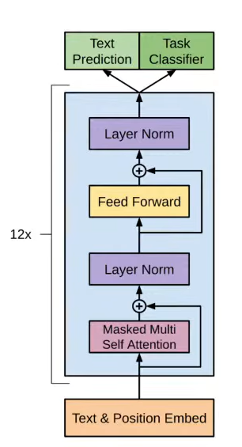
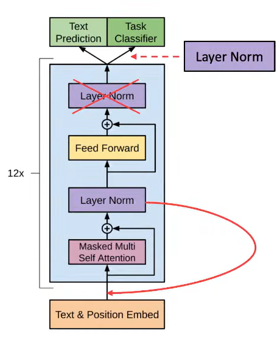

a | a* b = {a, b, ab, aab, aaab, ...}

(11 | 0)* (00 | 1)*
奇數個 1 出現在奇數個 0 前面不能
ex: 01010 不能

(1 | 01 | 001)* (e | 0 | 00)
連續三個 0 不能

(D*.D | D.D*)
D = [0 ~ 9]

0.5, .5, 123.6, 9.2, 9.237, 9.

---

M = (Q, $\Sigma$, $\delta$, $q_{0}$, F)

Q = {$q_{0}, q_{5}, q_{10}, q_{15}, q_{20}$}

$\Sigma$ = {5, 10}

F = {$q_{20}$}

$\delta$($q_{0}$, 5) = $q_{5}$ 

$\delta$($q_{5}$, 5) = $q_{10}$

$\delta$($q_{10}$, 5) = $q_{15}$

$\delta$($q_{15}$, 5) = $q_{20}$

$\delta$($q_{0}$, 10) = $q_{10}$

$\delta$($q_{10}$, 10) = $q_{20}$

---

M = (Q, $\Sigma$, $\delta$, $q_{0}$, F)

Q = {$q_{0}, q_{1}, q_{2}$}

$\Sigma$ = {0, 1}

$\delta$($q_{0}$, 0) = {$q_{1}, q_{2}$}

$\delta$($q_{1}$, 0) = {$q_{1}$}

$\delta$($q_{2}$, 1) = {$q_{2}$}

---

- 字串長度 0
- 空集合

--- 

Relation
- Reflexive
if (a, b) /belongs R for every a /belongs A
aRa

- Symmetry
aRb = bRa

- transitinity
aRb, bRc -> aRc

Back tracking is not that powerful
Parsar with no back tracking
(frist set, follow set, selection set)

[Ambiguous Grammar](https://www.google.com/url?sa=i&url=https%3A%2F%2Fwww.geeksforgeeks.org%2Fambiguous-grammar%2F&psig=AOvVaw16puthtwLbOpQ45_NJxyBy&ust=1711547242637000&source=images&cd=vfe&opi=89978449&ved=0CBIQjRxqFwoTCKCr_LyIkoUDFQAAAAAdAAAAABAE)