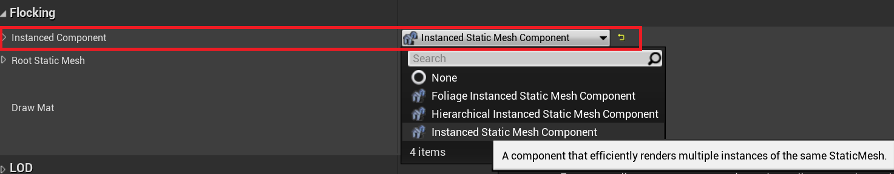
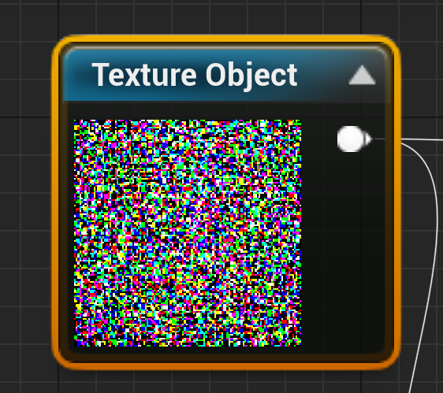
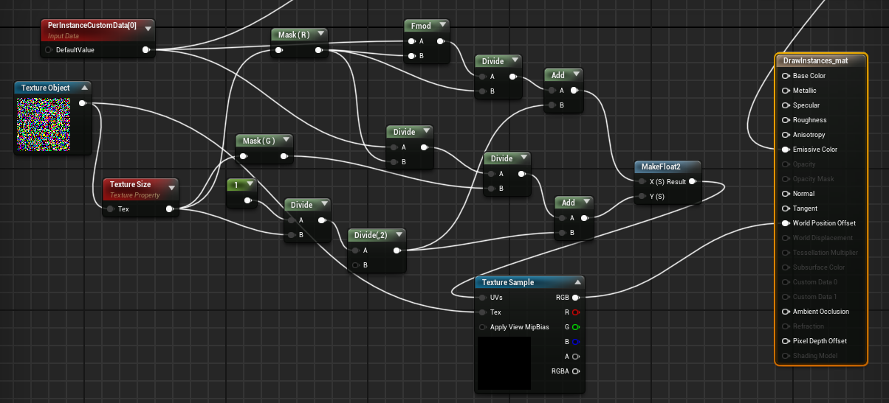

source code: https://github.com/aceyan/UE4_GPGPU_flocking/tree/ComputeShader

### GPU Instances

這個專案使用 GPU Instancing，一次渲染大量 Static Mesh。為了讓每個 instance 有區別，它賦予每個 instance 一個 CustomData，作為分辨的 ID。

```cpp
UPROPERTY(EditAnywhere, BlueprintReadWrite, Category = "Flocking")
	class UInstancedStaticMeshComponent* InstancedComponent;

for (int i = 0; i < instatnceNum; i++)
{
	FTransform t = FTransform();
	InstancedComponent->AddInstance(t);
	InstancedComponent->SetCustomDataValue(i, 0, i);
	UE_LOG(LogTemp, Warning, TEXT("AddInstance %d"), i);
}
```



然後藉由 PerInstanceCustomData[0]，取得不同的 Instance ID，然後更新它們各自的 Material 的 World Position Offset (相對位置) ，來達到移動的效果。

### GPGPU

由於運算量龐大，可以藉由 GPGPU (Compute Shader) 來計算。那要怎麼直接把 GPGPU 算出的結果傳給 World Position Offset？

這裡使用 Render Target (RT) 去除存每個 Instance 的位置、速度，所以每個 Texel 的 RGB 儲存的是 World Position Offset 的 XYZ。因此，遊戲開始的時候，儲存 Position 的 Render Target 會長這樣，五彩繽紛的顏色就代表各種 World Position Offset。



藉由這個方法，CPU 叫 GPU 算完可以直接渲染，不用再回傳到 CPU，所以整個邏輯是 GPGPU -> RenderTarget -> Material。

最後，只要想辦法取出每個 Instance 對應到的 Texel 的顏色，傳到 World Position Offset 就好。



看起來很複雜，實際上就是根據 ID 算出對應的 Texel 的座標，左上是 (0, 0)，右下是 (1, 1)，再 Sample 出 Texture Object 某 Texel 的顏色。
